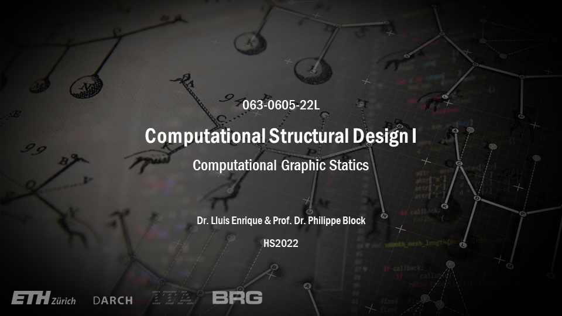

# About

<figure><figcaption></figcaption></figure>

### Welcome to the course Computational Structural Design I: Computational Graphic Statics!

This course presents new structural design opportunities that emerge when the intuitive techniques of graphic statics are combined with computational tools. After a review of graphic statics fundamentals and an introduction to basic parametric tools, the course focuses on exploiting the user’s ability to interact with form and force diagrams within a computational environment with real-time visual feedback, in order to explore new structural design methods that are simply not possible with conventional tools. The practical potential and relevance of these new methods will be demonstrated through various design-oriented tutorials and exercises.

### **General information**

* **Name**: 063-0605-22L : Computational Structural Design I ([ETH course catalogue](http://www.vvz.ethz.ch/Vorlesungsverzeichnis/lerneinheit.view?lerneinheitId=164546\&semkez=2022W\&ansicht=LEHRVERANSTALTUNGEN\&lang=en))
* **Semester**: Autumn Semester 2022
* **Lecturer**: Dr. Lluis Enrique, Prof. Dr. Philippe Block
* **Date/time:** Fridays, 09:45 - 12:00&#x20;
* **Location**: [HPT](http://www.mapsearch.ethz.ch/map/mapSearchPre.do?gebaeudeMap=HPT\&geschossMap=C\&raumMap=103\&farbcode=c010\&lang=en) [C 103](http://www.rauminfo.ethz.ch/Rauminfo/grundrissplan.gif?gebaeude=HPT\&geschoss=C\&raumNr=103\&lang=en)
* **Language of instruction**: English
* **Periodicity**: yearly recurring
* **Comment**: In order to participate in this course, it is recommended that the student has previously taken the courses Structural Design I and II.
