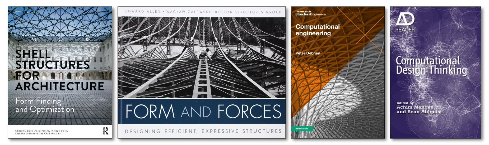

# References

This page provides a list of books and helpful texts for further reading.&#x20;

## Main Texts

Adriaenssens, S., Block, P., Veenendaal, D., & Williams, C. (Eds.). (2014). _Shell Structures for Architecture: Form Finding and Optimization_ (1st ed.). Routledge. [https://doi.org/10.4324/9781315849270](https://doi.org/10.4324/9781315849270)

Allen E. & Zalewski W. (2009). _Form and Forces: Designing Efficient, Expressive Structures_.  John Wiley & Sons. ISBN: 978-0-470-17465-4.

Debney P. (2020). _Computational Engineering_. London: The Institution of Structural Engineers.&#x20;

Menges, Achim, and Sean Ahlquist. 2011. _Computational design thinking_. Chichester: J. Wiley & Sons.

## Additional Texts

### Structural Design

Block P., Gengangel C. & Peters S. (2013). _Faustformel Tragwerksentwurf_. DVA Deutsche Verlags-Anstalt. ISBN: 978-3-421-03904-0.

Muttoni A. (2011) _The art of structures, Introduction to the functioning of structures in architecture_. EPFL Press. ISBN-13: 978-0415610292, ISBN-10: 041561029X.

### Computational geometry & design

Ko J. and Steinfeld K. (2018). _Geometric Computation: Foundations for Design_. London: Routledge.

Woodbury R. and Gün O.Y. (2010). _Elements of parametric design_. London: Routledge.

Issa R. (2019). _Essential Mathematics for Computational Design_. Rober McNeel & Associates.

Tedeschi A. and Wirz F. (2014). _AAD\_Algorithms-Aided Design : Parametric strategies using Grasshopper®_ (First ed.). Brienza: Le Penseur Publisher.

Terzidis K. (2008). Algorithmic architecture (Reprint. 2008 ed.). Oxford: Architectural Press.

### Graphic statics

#### Historical texts

Maxwell J.C. (1864). _On reciprocal figures and diagrams of forces_. Philosophical Magazine Series 4 27 (182), pp. 250-261.

Culmann K. (1864). _Die Graphische Statik_. Zurich: Verlag Meyer und Zeller.

Cremona L. (1872). _Le figure reciproche nella statica grafica_. Milano: Tipografia di G. Bernardoni.

Wolfe W.S. (1921). _Graphical analysis; a textbook on graphic statics_. New York: McGraw-Hill.

#### Recent texts

Allen E, Zalewski W. (2009). _Form and forces: designing efficient, expressive structures._ Chichester, UK: John Wiley and Sons.

Van Mele T., Lachauer L., Rippmann M. and Block P. (2012). [_Geometry-based Understanding of Structures_](https://block.arch.ethz.ch/brg/publications/399), Journal of the International Association of Shell and Spatial Structures,53(4): 285-295.

### Algebraic graph statics

Micheletti A. (2008) [On generalized reciprocal diagrams for self-stressed networks](https://journals.sagepub.com/doi/10.1260/026635108786260974). _International Journal of Space Structures_. 23, 153–166.

Van Mele T. and Block P. (2014) [Algebraic graph statics](https://www.sciencedirect.com/science/article/pii/S0010448514000682?via%3Dihub). _Computer-Aided Design._ _53, 104–116._&#x20;

Alic V. and Åkesson D. (2017). [Bi-directional algebraic graphic statics](https://www.sciencedirect.com/science/article/pii/S0010448517301446?via%3Dihub). _Computer-Aided Design._ 93, 26-37.

### Thrust network analysis & RhinoVAULT

Block P. and Ochsendorf J. (2007). [Thrust Network Analysis: A new methodology for three-dimensional equilibrium](https://block.arch.ethz.ch/brg/content/publication/thrust-network-analysis-a-new-methodology-for-three-dimensional-equilibrium), _Journal of the International Association for Shell and Spatial Structures_, 48(3): 167-173, 2007.‌

Block P. (2009).  [Thrust Network Analysis: Exploring Three-dimensional Equilibrium](https://block.arch.ethz.ch/brg/publications/361), PhD dissertation, Massachusetts Institute of Technology, Cambridge, MA, USA, 2009.

Rippmann M., Lachauer L. and Block P. (2012). [RhinoVAULT - Interactive Vault Design](https://block.arch.ethz.ch/brg/publications/414), _International Journal of Space Structures_, 27(4): 219-230.

Rippmann M. (2016) [Funicular Shell Design: Geometric Approaches to Form Finding and Fabrication of Discrete Funicular Structures](https://block.arch.ethz.ch/brg/publications/591), Doctoral dissertation, Department of Architecture, ETH Zurich, 2016.

### 3D graphic statics

Rankine W. (1864). Principle of the equilibrium of polyhedral frames. _Philosophical Magazine Series 4 27 (180)_, 92.

Akbarzadeh M., Van Mele T. and Block P. (2005). [On the equilibrium of funicular polyhedral frames and convex polyhedral force diagrams](https://block.arch.ethz.ch/brg/publications/444). _Computer-Aided Design 63_, 118–128.

McRobie A. (2017). [The geometry of structural equilibrium](https://royalsocietypublishing.org/doi/10.1098/rsos.160759). _Royal Society Open Science, 4_.

Lee J. (2018). [_Computational Design Framework for 3D Graphic Statics_](https://block.arch.ethz.ch/brg/publications/897). PhD thesis, ETH Zurich, Zurich, Switzerland.
