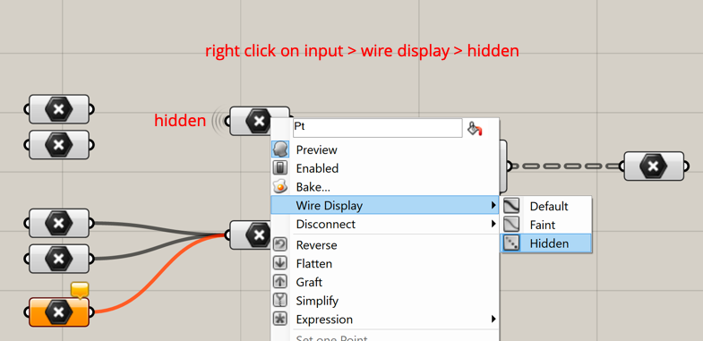

# Tutorial

## Learning Goals

In this tutorial, participants will learn:

* Basic parametric thinking and modelling with Rhino and Grasshopper
* The structure and organization of UI of Rhino and Grasshopper
* Overview of the basic components in Grasshopper
* How to assemble components together in Grasshopper to execute simple operations
* Vector-based geometric operations
* Introduction of data structures and management in Grasshopper (tree)

## 1. Application Interface

**Grasshopper** is a **visual algorithm** editor that is integrated into the Rhino **3D-modelling environment**. It allows to set up parametric models intuitively and visually. &#x20;

Let's get started: open **Rhinoceros 6** on **Windows** and Grasshopper. To launch Grasshopper, either type in the Rhino command prompt `Grasshopper` or navigate in the _**Standard toolbar**_ to the _**Grasshopper icon**_.&#x20;

.png>)

In Grasshopper, the visual algorithms can be built by connecting **components** with **wires** on the _**Grasshopper canvas**_. If the components contain geometric information, they are **previewed** in the _**Rhino Viewport**,_ thus both, Rhino and Grasshopper, always work in parallel.

.png>)

Besides the _Grasshopper canvas_ that serves as the **work area**, the Grasshopper window also contains the _canvas toolbar_  for **display options** and the _component panels_ for **accessing** all the components. The components are organised in several tabs and the core Grasshopper components are shown here for overview:

.png>)

To **add a component** to the _canvas,_ navigate to it in the _component panels_ and `drag` it onto the _canvas_. Alternatively, for a **fast search**, `double-click` or hit `space` on the canvas and search for its name. To **determine the location** of an already placed component in the component panels, hold `ctrl+alt` (or `cmd + option`on Mac), thus the location will be indicated by a red circle. This is useful if you wish to explore similar or related components.

.png>)

## 2. Basic Principles

Composing algorithmic definitions are like writing a recipe for baking a cake: step by step, you describe the input ingredients, the instructions on how to process them, and you receive an output that you use for the next step. In Grasshopper, each instruction step is represented by a **component**. Likewise, a component consists of **input parameters**, **instructions** processing the input data, **output parameters**. The data is **inherited** between the output and input of components with **wires**. In this manner, Grasshopper definitions are composed.&#x20;

.png>)

If no wire is connected to an input of a component, meaning no data is inherited, a default value is set already for simple inputs, such as numbers or boolean values. This value can be locally modified with _**right-click on the input > Set Integer.**_

.png>)

The **flow of data** must be respected in an algorithmic linear sequence from left to right with no connection back to the input of precedent components. Data loops are not possible and in that case, a warning will appear! It's like baking a cake, you cannot use the baked cake as its input ingredients, but you can execute multiple actions at a time throughout the process.&#x20;

.png>)

But before we get started, let's make sure, we have the same display settings: In the _**top menu**_, go to _**Display**_ and then disable the _**Draw Icons**_ and the _**Draw Full Names**_ option. This way you will see the text and input/output names as on the left-hand side, whereas with enabling you would see them as on the left-hand side. (However, the images in this Gitbook are prepared for Icon view with the name of the component next to it, as I generally recommend using the visual icon view).

.png>)

## 3. Maths Operators

Grasshopper can serve in its very basic use as a **calculator** for simple math operations. These will become **crucial** as part of our GS Grasshopper definition later. These simple math operations include the `Addition`, `Subtraction`, `Multiplication` and `Division` component. Further important  components are the `Negative` and `Absolute` component to compute the negative and absolute value of a number, respectively. The number values can be input either with a `Panel`  component, that requires a manual change of the number or with a `Number Slider` component, that allows for a flexible modification.&#x20;

Alternatively, input values can be selected from a **defined set**: The `boolean toggle` component allows to switch between True (=1) and False (=0), thus "turning a value on or off". With the `value list` component, you can set any desired values to switch between, e.g. Negative and Positive. (Compare options A and B.)

Mathematical operations can also be carried out with the `Expression` component: it allows to input a **function**, to **round** to a specified number of decimal digits, and many more. Some components also allow so modify the input with an expression directly with _**right-click on the input value > Expression**_.&#x20;

## 4. Wire Connection Management

Multiple wires can connect the same parameter of a component. To **add** a wire to a parameter, press `shift` and connect the wire.  (Then, the same action is applied to both input elements.)

.png>)

To **remove** a wire connection, press  `ctrl` (or`cmd`on Mac) **** and connect the wire to be deleted.

.png>)

To **change** all wires from one parameter of a component to another, press `shift + ctrl` _****_ (or `shift + cmd` on Mac) **** and move the wire connections.

.png>)

## 5. Geometry Display Control

Components that contain geometric information **preview** this geometry by default in **red** colour in the _Rhino Viewport_. If the component on the _Grasshopper Canvas_  is `selected` it will appear **green** itself as well as its geometric representation is the _Rhino Viewport_. In this manner, you can verify which component represents what.&#x20;

.png>)

If you wish to **disable** the preview of a component, `right-click` onto it to open its context menu and toggle the `preview`  option. Then, its geometric representation is hidden and the component appears in darker grey.

.png>)

Another manner to **disable** the preview of **all components** at once and to draw only the selected components can be set as an option in the _canvas toolbar:_  toggle the green icon to `enable 'draw only for selected'.`

.png>)

The **preview colours** can be modified in the `document preview settings` accessible with the orange/white icon in the _canvas toolbar._ Let's now modify the normal colour to grey instead of red, because in graphic statics the colour red is reserved to represent elements in tension.

.png>)

If you want a single object to be displayed in a specific colour you can use the **colour swatch** component (e.g. blue) together with the `custom preview` component (the green one is selected):

## 6. Geometry

The main geometric objects required for Graphic Statics in Grasshopper are points, vectors and lines.

A **point** is defined by its coordinate values. In a 2D space, these are the X- and Y-coordinate, and in 3D space, these are the X-, Y- and Z-coordinate. In Grasshopper, we can construct a point with the `Construct Point` component where we can set and later modify the coordinates with `Number Sliders` gradually (Point A). Alternatively, a point position can be chosen is the Rhino Viewport manually and later can be dragged around (point B).&#x20;

.png>)

A **vector** is defined by its magnitude and direction in space solely. One can imagine a vector as the geometric information that carries a point A to point B in space (the Latin word vector means "carrier"). Also, f**orces** are usually expressed with vectors, as they are also defined by their magnitude and direction.&#x20;

.png>)

In Grasshopper, vectors can either be constructed by assigning all XYZ vector components with the `Vector XYZ` component, in which the magnitude and direction are defined at once, or with the `unit X` (or Y or Z) component for the direction which takes as input the magnitude. Vectors are commonly graphically represented by an arrow, however, this requires the additional information of an anchor point. In Grasshopper the `Vector Display` component offers the vector preview. &#x20;

.png>)

A **line** is bounded by a start- and endpoint. Thus in Grasshopper, it can be constructed from two points with the `Line`  component (line A). Alternatively, a line can be constructed from a vector that defines its direction, a start point and a given length with the `Line SDL` component (line B). This means one can **switch** between vectors to lines with additional information. But one can also convert a line to a vector directly solely with a `vector container` component.

.png>)

## 7. Geometric Operations

Any type of geometrical object can be **moved** with the `Move` component along a translation vector. (This basically creates a copy and does not modify the initial point).

.png>)

Equally, any type of geometrical object can be **rotated** around an axis or in a plane. For our purpose, the rotation of vectors is important. Use the `Rotate Vector` component that takes as input the vector, the rotation axis and an angle in radians. Transform the angle from degrees to radians with the `Radians` component.&#x20;

.png>)

Alternatively, the angle can be input as degree value directly, if the Angle input is modified to `Degrees`.

.png>)

Please also explore the other transformation components in Grasshopper.&#x20;

If the **angle** between two **vectors** is to be determined, the `Angle` component returns the value in Radians and with the `Degrees` component it can be converted to Degrees (in this case with a minor rounding error). Also, the **length** of a **vector** can be determined with the `Vector Length`  component. Likewise, the **length** of a **curve** or line can be measured with the `Length` component.&#x20;

.png>)

The direction of a vector can be **reversed** (meaning rotated by 180°) either with the `Reverse` component or through `Multiplication` with -1.  &#x20;

.png>)

The `Multiplication` component can also be used to **scale** the length of a vector. Alternatively, the length of a vector can be set to a given value with the `Amplitude` component.&#x20;

.png>)

The **intersection** point of **two lines** can be found with the `Line | Line` component. Note that the lines must not actually intersect and the component returns the intersection of its virtual extensions.&#x20;

.png>)

Likewise, the **intersection** of a **line and curve** can **** be determined with the `Curve | Line` component. If multiple intersections are found, the component returns a list of points. To select the first point, use the `List Item` component (see more information on data structures in the following section 8.).&#x20;

.png>)


**Lines** and **Curves** are two different object types in Rhino/Grasshopper! A line can be converted to a curve but **not** the other way around: A line is a straight object spanning between two points or a point, vector and length, whereas a curve can be anything connecting points either in a smooth or polyline manner.


Check out the `PLine` and `IntCrv` component to connect multiple points in Grasshopper or select a Curve or Polyline directly from Rhino (below):

## 8. Data Structures

.png>)

In Grasshopper the structure to store data is called **data trees**. A tree consists of branches that each can have branches and subsequently leaves. A data tree can have only one branch with one leave and is thus a **single item**. It can also have only one branch with multiple items and is thus a **list** of items. It can also have multiple branches that each have one/multiple/no leaves and is thus called a proper **tree**. Then it is basically a list of lists. To organise the data, each item is given a **path** and **index**.&#x20;

.png>)

This type of data structure is particularly useful when **combining** data: for example to create lines in between a **single** point and all items of a **list** of points, Grasshopper combines the two sets automatically (and no programming loops are required). Equally two lists of points would be combined in parallel.

.png>)

Two lists can be **combined** into **one list** with the `Merge` component, or they can be combined into a **tree** with each list into a **branch** with the `Entwine` component. To `flatten`  removes the branch information and combines them again in one list. To `graft,` sorts every single item into its own branch. The `List Item` component returns according to its index a single **item** from a list, whereas the item from each branch of a tree.

.png>)

Wires are drawn using a different style for every type of data flow, such as single items, lists, trees or no data at all. (This display option can be disabled in the menu _**Display > Draw Fancy Wires,**_ but it is strongly recommended not to do so.)&#x20;

.png>)

**Let's explain all of this with a simple example step by step:**

We divide a curve into 4 segments resulting in a **list** of 5 point **items** (index from 0 to 4):

If we want a **single item** from the list only we can use the `item` component. The index by default is 0, this input can be changed with a `number slider`:

If we have a second list of division points and we want to **combine both lists into one list** (meaning the same branch) of 10 point items, we use the `merge` component or we **plug** them both into **one** **container** (its the same):

If we want to create connecting lines from a **single** random point to **all** division points we can do so easily by combining a single item and a list in one line component,  Grasshopper does the job of **pairing** the single item with all list items (like in a loop in coding).&#x20;

However, if we have **two** points and want to connect **one** with the division point of the **right** and the **other** with the division points on the **left**, how could we do this?

If we just connect them like this, it pairs basically the 1st item of list A (random points) with the 1st item of list B (division points) and then the 2nd item of list A with **all remaining** items of list B 😕

This is where the Grasshopper tree structure with branches come in useful: each **branch** will be **paired** with the **respective branch** from the other tree: so let's put the random points into separate branches using the `graft` option (right-click onto the component > Graft). This pairs both random points with all division points.

So let's put the division points from the left curve into one and from the right curve into **separate branches** with the `entwine` component and we get what we wanted **😊**

&#x20;

## 9. Logical Operations

To sort elements according to certain criteria, **logical operators** in combination with **list sorting** components are powerful. Logical operators can be the `Larger Than` component, `Smaller Than` component, and `Equality` component (or better the `Similarity`  component to react to rounding errors). These can test a list of numeric values against a threshold value and return booleans (either True or False). With the boolean list, the initial list of items can be sorted with the `Dispatch` component into one list containing all the 'False' items and one list containing all the 'True' items. Basically, it **splits 1 list into 2 lists** depending on a boolean pattern:

For example, if we want to find all points that are above a random point (in y-coordinate direction), we first deconstruct the points into their coordinates with the `pDecon`component, second compare the y-values with the `smaller` component, which returns a list of boolean values, and lastly with we `dispatch` the list of points based on that boolean list.

Alternatively, if we want to create **2 lists from 1** based on a pattern, we can do so either with the  `Pick'n'Choose` component or the `Weave` component.&#x20;

With the `Pick'n'Choose` component, **specific** **items** of two lists of data can be **merged** according to a boolean **pattern**, that can be determined with logical operators or set manually.&#x20;

In contrary, the `weave` components interweaves **all items** of two lists together but in the order of a boolean pattern:

If the input data is not a list but a single item that should be integrated several times, **graft** the pattern input and flatten the output again.&#x20;

To determine, how many items of a list are True or False, use the `Mass Addition` component that will **sum up all** list values.

## 10. Organise your Definitions

To keep Grasshopper scripts easy to read and for a better overview, wire connections can be either hidden completely or faint. To **hide** or **faint** wire connections _**right click on input > wire display > hidden or faint**_.&#x20;

To organise your definition into different sections, **group** components. Select the components to group and  press `ctrl + G` or _**right-click on canvas > Group**_.&#x20;

.png>)

The group can also be assigned a **name** by _**right-click on the group**_.&#x20;

.png>)

Also the **colour** of the group can be modified by _**right-click on the group > Colour.**_&#x20;

.png>)

Another manner to name things, write titles or comments is with the `Scribble` component.&#x20;

.png>)

**Now, you should have the basic knowledge for the exercise to get Grasshopper skills to later apply to graphic statics.**&#x20;
