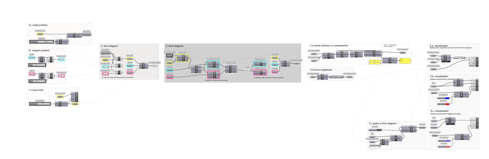

# Tutorial

## Learning Goals

In this tutorial, participants will learn:

* the basic principles of **procedural graphic** statics
* to construct an **interactive** form and force diagram for a **single node bridge** with **Grasshopper**
* and to **visualise** the results meaningfully.

## Introduction to Procedural Graphic Statics

[Last week](../i.-introduction/) the concept of **Graphic Statics** was introduced/revised with **manual construction** on the blackboard. It should have become clear, how **powerful** this method is for designing and understanding structures and how this approach can enhance architectural expression bringing form and forces in relation. However, the manual construction of form and force diagrams can be **tedious**, in particular for exploring design variations.

.png>)

Thus, **interactive drawings** enable exploring and understanding the relation of form and forces for various designs in a **playful manner** (see video below). **** More examples can be found on the [eQuilibrium](https://block.arch.ethz.ch/eq/drawing) platform.

.mov>)

These **interactive drawings** can be constructed with two methods: either with **procedural geometric** construction or with **automated algebraic** construction. The latter will be subject to [session IV](../iv.-algebraic-gs/). And today, we will focus on the procedural geometric construction using **Grasshopper**. There, we basically follow the same logic as in the manual geometric construction but **parametric** to respond to changing input variables.&#x20;

.png>)

## Introduction to the Single-Node Bridge

In this tutorial, we will create an interactive form and force diagram of a bridge with a single node. The single-node bridge is defined solely by three cables (left, right and centre), a single node in which they all connect, and an external force from the bridge deck (defined in the centre and with a magnitude of 15 kN).&#x20;

.png>)

These are the four possible bridge types with a single node:

.png>)

Basically, it all comes down to the four basic node types:

.png>)

More nodal configurations in a 2D space are not possible, however, they can have unlimited variations in the angles of the elements. But how can we explore these interactively?

## Implementation in Grasshopper

### 0. Overview of Procedural Geometric Construction

This can be achieved with the following Grasshopper definition. It is structured into multiple groups. These are: The parametric input such as the nodal position (1.a),  the support position (1.b) and the input load (1.c). From these inputs, the form diagram (2.) and force diagrams ( 3.) can be computed. Finally, the force sense (4.a) and force magnitude (4.b) are calculated and then visualised (5.).&#x20;

The Rhinoceros file for the canyon can be downloaded below:


Rhino6 file for Tutorial 2



Rhino7 file for Tutorial 2


### 1. Parametric Input

#### 1.a Nodal Position

This group will define as input for the form diagram the position of the node of the bridge by moving the midpoint of the deck upwards or downwards.

1. _Input:_ select the **bridge anchor point** with a `point` container&#x20;
2. _Input:_ define the **midpoint height** using a `number slider` component. Edit the number slider so that its numeric domain ranges from a negative to a positive value (e.g. -10 to 10). The positive and negative values will refer to the position of the node above and below the bridge deck, respectively.&#x20;
3. use the `unit Y` component to define the translation vector and input the midpoint height value as its multiplication factor.&#x20;
4. move the bridge midpoint with the `move` component along the translation vector.
5. _Output:_ the relevant output of this group is the **node location** with a `point` container
6. (comment: the `vector display` component is for explanation only.)

#### 1.b Support Position

This group will define as input for the form diagram the position of the anchor points on the two cliffs of the canyon by selecting a point item from a list of points on the canyon cliff on each side.

1. _Input_: select the left **cliff** with a `curve` component
2. Divide this curve into equally spaced points with the `divide` component and set the N Count input to e.g. 20
3. _Input_: Define the point to pick with a `number slider` component which is set to **integer** values with the same range as subdivision points (20)
4. With the `list item` component, retrieve the point at the set index of the point list on the left cliff
5. _Output_: the relevant output of this group is the **support point** with a `point` container
6. repeat the same steps for the right cliff curve and highlight the left and right side visually with group colours. (left = turquoise, right = pink)


The colour code (of pink and turquoise) in the next steps does not indicate the state of internal forces in the structure (the typical red and blue). It is just a way to label the elements in terms of left and right positions!


####

#### 1.c Input Load

In this group, we will define the external load. To describe a force, we need to define the force magnitude (15kN), the sense (downwards) and the direction. The external force acts in the direction of gravity (here: negative Y-direction) and at the midpoint of the bridge deck.&#x20;

1. _Input:_ bring down the **bridge anchor point** from _1.a nodal position_ with a `point` component
2. _Input:_ use a `number slider` component and set the **force magnitude** to -15 (the minus is for the **force** **sense** in negative Y-direction)
3. use the `unit Y` component to choose the **force direction** and **** connect the force magnitude as its multiplication factor.&#x20;
4. use the `vector display` component to visualise the vector to verify if the step is correct. As anchor point set the bridge midpoint.
5. _Output_: the relevant output of this group is the **force vector**.

In case you could not follow, here is the Grasshopper definition up to here:


Grasshopper step 1. Parametric Input&#x20;


### 2. Form Diagram

In this group, we will build the form diagram in the context of the canyon. We will construct three edge lines spanning from the internal centre node to the three external nodes, the bridge deck anchor point, the left support point, and the right support.


By definition, the edge lines must be oriented **away** from the centre node!


1. _Input:_ from step 1. we will bring over the centre node, bridge anchor point, left support point, and right support point as `point` components
2. we will construct the **edge lines** spanning in between the centre node and the other nodes with the `Line` component
3. we will put these lines into `line` containers so that we can colour code them:
   * center = yellow
   * left = turquoise
   * right = pink
4. we merge all lines into one list of lines with the `merge` component&#x20;
5. _Output:_ the edges of the **form diagram**

Now play with the position of the centre and support nodes and verify if the script works for all cases.

.png>)


The edge lines of the form diagram represent the lines of action and can be converted to vectors.


In case you could not follow, here is the Grasshopper definition up to here:


Grasshopper step 2. Form Diagram


### 3. Force Diagram

Now let's construct the force diagram by translating the lines of actions to the force diagram. We will do so in steps, let's start with the centre edge:

1. _Input:_ choose a random force **diagram location** with a `point` container&#x20;
2. _Input_: from _1.c Input load_  take the **force vector** with a `vector` container&#x20;
3. now create a line that represents the **force in the centre element**. Therefore, use the `line SDL` component: The force diagram location is the start point and the direction and length are defined by the force vector.
4. _Output_: the **centre edge** line; mark with yellow


The force vector's line of action is identical to the line of action of the centre edge of the form diagram. However, it also contains the information of the force magnitude and sense, whereas the length of the centre edge in the form diagram is described geometrically and the sense changes depending on the nodal position of the bridge centre node.&#x20;


Now we want to close the force polygon. To add the right and left elements we first have to construct auxiliary lines, because only their directions are determined by the lines of action, but their lengths are unknown, thus we must determine the position of the pole:

1. _Input_: take the left edge and right edge from _2. form diagram_ and convert to **lines of action** vectors with the `vector` component&#x20;
2. Input: the start and end point of the force diagram's centre edge with the `end points` component
3. to translate the left and right lines of action into edges in the force diagram, we first have to create **auxiliary lines** and for this, we again use the `line SDL` component. The directions are defined by the line of action vectors. To determine the starting points, we must use the rule of the clockwise order of lines. In the form diagram, this means that starting from the centre line, in **clockwise order**, first comes the left element and second the right element. Thus, in the force polygon, we have to connect the left element at the end of the centre line. Technically we must connect the right element at the end of the left element line, but this point is still unknown. However, we know that the right line's end will connect to the start of the centre line, so we connect it there for now. (The length of the auxiliary lines does not matter when searching the intersection point. )
4. to find the **intersection point** between the left and right auxiliary line in the force diagram use the `line | line`  component.&#x20;
5. _Output_: the **pole** with a `point` container


By definition the edge lines order and direction in the force polygon must be in clockwise order!


Let's now complete the force polygon:

1. _Input_: the **start and end point** of the centre edge and the **pole** as `point` containers&#x20;
2. construct the final force lines of the right and left element in the force diagram with the `line`  component. Watch out for the order and direction of the lines according to the clockwise rule, so that you receive a closed force polygon!
3. merge all lines of the force polygon with the `merge` component&#x20;
4. _Output:_ the edges of the **force diagram**


The edges in the force diagram indicate the magnitude of forces in the elements and are parallel to the form diagram edges. Note that the edges are not oriented yet according to their sense (compression or tension), this will be our next step.&#x20;


Now play again with the nodal positions from Section 1. and verify if for all cases the force and form diagram correspond to each other, meaning they are parallel.

In case you could not follow, here is the Grasshopper definition up to here:


Grasshopper step 3. Force Diagram


### 4. Sense and Magnitude of Forces

#### 4.a Sense of Forces (Compression vs. Tension)

Now we want to determine the sense of the forces, meaning if it's a compressive or tensile force.&#x20;


If the edges in the form and force diagram are oriented in the same direction, the edge is in tension; if they are in opposite direction, the edge is in compression (as by default definition).


Let's first look at the left edge only:

1. _Input:_ the edge line from the form diagram and force diagram for the left edge. &#x20;
2. to determine the orientation between two edge directions, we use the `vector angle` component. (The input as a line is automatically transformed into a vector that contains the information of the direction of the line.)
3. the angle is output in radians, use the `degree` component to transform the angle to degree values
4. and round them to the nearest integer with the `round` component to account for numerical errors.
5. now we want to evaluate this angle in terms of direction: With the `equality` component we test for equality of the angle to the number 0, which we set as input for the second number, and we receive a boolean output, meaning either True or False.
6. for a visual output of the results, we can use the `weave` component, which depended on the input pattern (either True=1 or False=0) selects either the stream-0  or stream-1 input. Display it with a `panel` component.&#x20;


So, if the angle is 0°, equality holds, the output is _**True,**_ thus the edges are in the **same** direction meaning in **tension**. If the angle is 180°, inequality, holds, the output is _**False**_, thus the edges are in **opposite** direction meaning in **compression**.&#x20;

Compare the two following figures:


.png>)

Now we have determined the sense for one edge, however, we want the result for all three edges - here, **lists** come in handy (for more information on lists see [Section 1.9](../i.-introduction/tutorial-1.md#8-data-structures)). We have already combined the data of the form diagram edges with the `merge` component into one list with all form diagram edges and the same for the force diagram. Double-check that the elements are in the same order in the list!

1. connect them as input into the previous group instead of the single item edge input. Grasshopper automatically treats both lists in parallel, so that always the corresponding edges are compared.
2. only the `weave` component must be modified so that pattern input is grafted and the output is flattened again.&#x20;

In case you could not follow, here is the Grasshopper definition up to here:


Grasshopper step 4.a Sense of Forces


#### 4.b Magnitude of Forces

In this step, we want to determine the magnitude of forces: The length of an edge in the force diagram represents the force magnitude.

1. _Input_: the list of all edges from the force diagram.
2. calculate the length of all using the `length` component to receivve the force magnitudes.
3. this result might contain many decimal digits so let's round it to 2 decimal digits using the `expression` component with _**round(x, 2).**_
4. _Output:_ Magnitude of forces as float type ( in Grasshopper `number` container).

In case you could not follow, here is the Grasshopper definition up to here:


Grasshopper step 4.b Magnitude of Forces


### 5. Visualisation

Now we have solved the form and force diagram, so let's visualise the results.&#x20;

#### 5.a Visualise Force Magnitudes

We start displaying the force magnitude as text in the force diagram:

1. _Input_: list of lines of all edges of the force diagram and list of magnitudes of forces.&#x20;
2. For the text's location choose the midpoint of the edges using the `curve middle` component.&#x20;
3. use the `text tag 3d` component to display as text the force magnitudes.&#x20;

You can either repeat exactly the same for the edges of the form diagram or use the tree datastructure:

1. add the `entwine` component to combine the two data streams into a tree of two branches. (note: the wire is dashed for trees.)&#x20;
2. in the `text tag 3d` component, the data of each branch of location is now combined with the data of the text.

#### 5.b Visualise Force Vectors

The forces in the force diagram are visualised as vectors in red if in tension and in blue if in compression.

1. _Input_: list of lines of all edges of the force diagram and list of boolean values according to sense (compression or tension).
2. Use the `end points` component to receive the starting point of the edges as the vector anchor point.
3. display the lines as vectors with the `vector display ex` component.  If the lines are connected to the vector input, they will be transformed into vectors automatically.&#x20;
4. set one `colour swatch` component to red for tension and one to blue for compression, respectively.
5. use the `weave` component to interweave the colours according to the boolean values into one list of colour items for each edge. (same as in section _4.a Sense_, graft the input pattern and flatten the output list).&#x20;

#### 5.c Visualise Form Diagram

You can follow the same principle to display the form diagram as described in the previous section, but just use the lines directly and don't convert them to vectors.&#x20;

1. The `custom preview` component allows displaying the lines in the desired colours.

To express the force magnitude in the edges visually, use pipes that vary their diameter dependent on the force magnitude.

1. _Input_: list of lines of all edges of the form diagram and list of magnitudes of forces. Add a scale factor for the pipe dimension either as a `panel` component or `number slider` and set it to 30.&#x20;
2. scale the force magnitude with the scale factor using the `division` component into values for the pipe radii.
3. create pipes with the `pipes` component around the form edges. Flatten the output. (more information on flattening in [section 1.9](../i.-introduction/tutorial-1.md#8-data-structures)).
4. add a `dispatch` component with a `boolean toggle` component so that the pipes can also be turned off. It's like closing a valve.
5. combine the pipes with the `entwine` component with the lines and use the tree as input for the group from the beginning of this section.&#x20;

Now your Grasshopper file should be completed. Play around with the input parameters in various configurations and verify if the results make sense.&#x20;

In case you could not follow, here is the completed Grasshopper definition. This should only serve as a reference if you want to look up things, but really try to **assemble it by yourself** to understand and practise! Otherwise the Exercise next week will be impossible to tackle.&#x20;


Grasshopper completed!


**That's it! You made it.**
