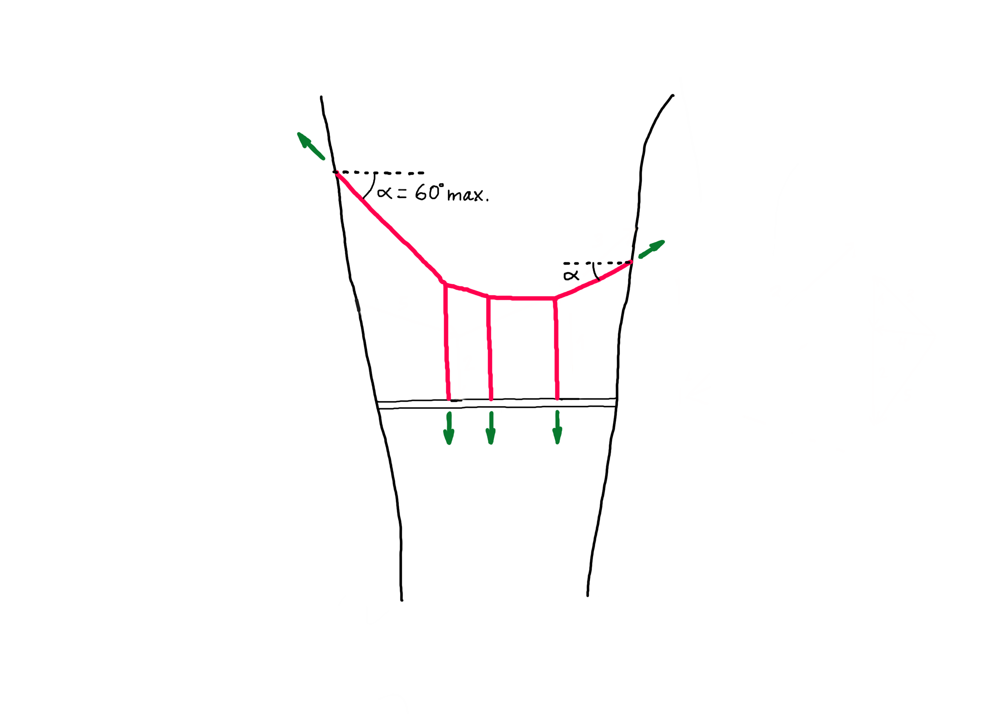

# Exercise


Please complete the tasks below, and submit a zipped folder that includes one Rhino file, four Grasshopper definitions (Tasks 1-4), and the PDF of the questionnaire with your answers by **9:00 am on Friday, November 5th**.

Please follow the file naming convention as shown in the [**Syllabus**](../../syllabus.md#submissions).  &#x20;

### [Submit exercise 3 here.](https://www.dropbox.com/request/QPlohOgdeTLfv4Vb2Gfa)


## Tasks

Complete the following 5 tasks using the Grasshopper file from Tutorial 3 as a starting point. Then answer the questions on the following document:&#x20;



### 1. Additional load

In tutorial 3 we created a parametric model, which, using graphic statics, finds the form of a funicular structure supporting a bridge deck. In this first model, we considered two loads representing the self-weight of the bridge. This exercise consists of adding a third load on the bridge deck.&#x20;


Before adding the anchor point of the third load, pay attention first to how the loads are ordered along the bridge deck in tutorial 2.  &#x20;


### 2. Change of rise

In tutorial 3 we showed how to change the rise of the funicular structure modifying the geometry of the form diagram. Find now a way to achieve the same thing this time by modifying the geometry of the force diagram. The key to do this is explained in [tutorial 3](../iii.-procedural-gs-ii/tutorial-3.md#4.-changing-the-rise).


You can use the initial Grasshopper file to solve this task. However, if you use the Grasshopper definition with three loads you created in Task 1 as a base you will get more interesting results.&#x20;


### 3. Tributary areas

In the algorithm shown in tutorial 3, the magnitude of the loads is defined with a number slider. For this reason, this value is valid no matter where along the bridge deck this load is located. Find out how the magnitude of the loads can respond to the tributary areas, so that each cable supports its respective part of the bridge deck. The scheme below shows you how to calculate the tributary areas for the different cables. Consider a self-weight of 1kN/m2.&#x20;


You can use the initial Grasshopper file to solve this task. However, if you use the Grasshopper definition that includes Tasks 1 and 2 you will get more interesting results.&#x20;


### 4. Constrained force diagram

In addition to the pedestrian bridge, the hanging funicular structure, along its curved shape, will also be used as a bridge for a via ferrata as shown in the reference picture below.&#x20;

To design our "stairway to heaven", we will consider two constraints:&#x20;

1. The angle of the steepest sections must not exceed 60 degrees in relation to the horizontal (see sketch below).
2. The funicular must work fully in tension.


You can use the initial Grasshopper file to solve this task. However, if you use the Grasshopper definition that includes Task 1 you will get more interesting results.&#x20;


### 5. Design exploration

Design two bridge structures and explain why you find these interesting. Finally, find the form a third rare structure in equilibrium. There are some families of solutions which lead to very strange result in equilibrium. Will you find them?


Take into account that the largest design space is in the model that includes Tasks 1, 2 and 3.&#x20;


## Solutions

You can download the solutions in the link below. For every task of this exercise, there is surely more than one possible solution, so don't worry if your Grasshopper definitions do not exactly match ours.



### Task 1

Task 1 asks you to add one more load on the bridge deck. To do this, you must modify the following parts of the initial definition: 1.a Input loads, 1.b\&c Resultant, 3. Internal forces and 4.a\&b Data for visualization. &#x20;

.jpg>)

### Task 2

To solve Task 2 you only need to move the polo O' in the force diagram along the direction of the closing string.&#x20;

.jpg>)

### Task 3

Task 3 asks you to consider the tributary areas, which affects the part 1.a. Input loads. In the initial Grasshopper definition, the magnitude of the loads is defined using a number slider that has nothing to do with the tributary areas. The solution shown below consists on measuring the distance of the part of the bridge that each anchor supports. As the area load of the bridge is 1kN/m2, we can directly use the numeric value of the distance as the load magnitude.

.jpg>)

### Task 4

In Task 4 we must add two constraints to the force diagram to find a particular family of equilibrium solutions. The task asks you to find solutions in which the bar elements of the funicular aren't steeper than 60° and are only in tension.&#x20;

#### First constraint

If we study the solutions that we obtain in the initial Grasshopper definition, we observe that the steepest elements are always at the extremes of the funicular and that their geometry is fixed when the supports are defined. In order to solve this task, instead of defining the supports and reaction forces in the form diagram, you will do this using the force diagram. The sketch below shows how to do this. Once we find a possible solution in the force diagram we will construct the form diagram and find the position of the supports along the curves of the cliffs. &#x20;

.png>)

#### Second constraint

In order to make sure that the solution is only in tension, the point O' must be to the left of the resultant. We can then simply check the x coordinate of O', compare it to that of any point lying along the line of action of the resultant and only allow solutions in which the x coordinate of O' is smaller.

### Task 5

The last question of Task 5 asks you to design qualitatively two new structures in equilibrium based on which you could now create a parametric model. The drawing below shows two possible solutions.&#x20;

