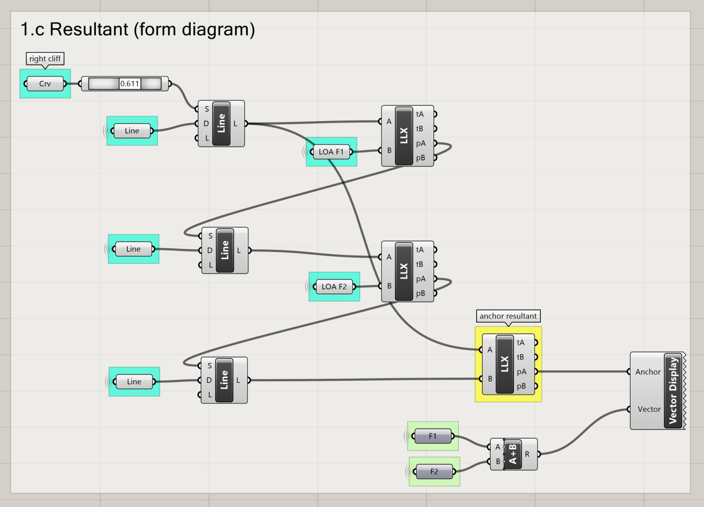
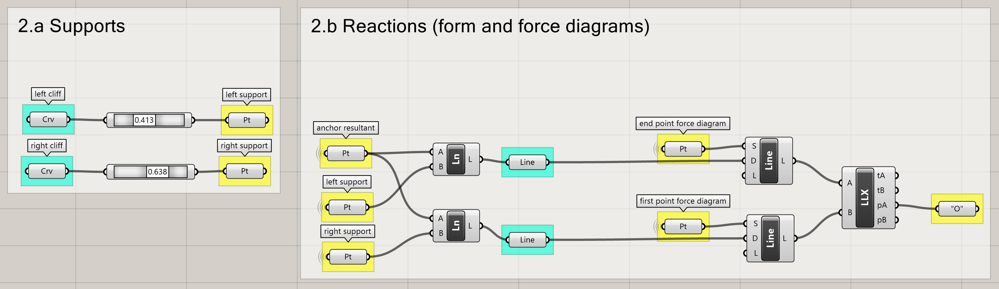
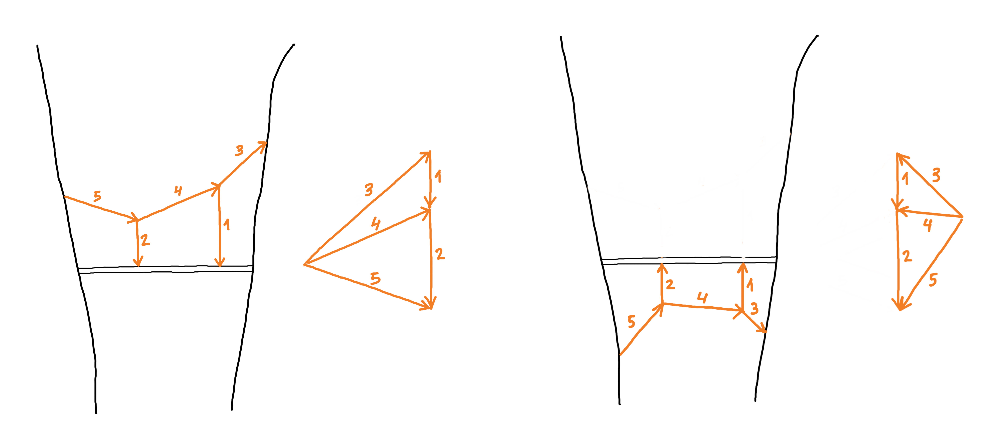

# Tutorial

## Learning Goals

In this tutorial, you will:&#x20;

1. be introduced to programming. &#x20;
2. compare the algorithm you built in module 2 increase your experience using Grasshopper.
3. learn to design funicular (compression- or tension-only) structures using graphic statics.
4. learn to create a parametric model for the form-finding of funicular structures.

## Content

The focus of the previous sessions was to introduce graphic statics and to show how to create a parametric model in Grasshopper of a simple structure composed of a single two-dimensional node in equilibrium. In this tutorial we will expand on these concepts. More specifically,  we will create a parametric model in Grasshopper for the form-finding of two-dimensional funicular structures using graphic statics.

## What is a Funicular Structure?

Funicular form is the shape that a tensile structure such as a cable or a chain takes when it finds the equilibrium under any combination of loads. Strictly speaking, a funicular structure is a structure in equilibrium that uses its funicular form to carry the acting loads to the supports by means of only tensile inner forces. If we keep that loading case but we reverse this form, we obtain the anti-funicular, in compression. In this course, we won't make this subtle difference between "funicular" and "anti-funicular" and we will call "funicular" both if the structure is in pure tension and if it is in pure compression. Funicular structures are common and surely you can find many examples around you, such as cable car structures and bridges. Well-known examples of funicular bridges are the Golden Gate bridge (1933-37), with funicular cables in tension, and the Salginatobel bridge (1929-30), with a funicular arch in compression.

Despite their elegant simplicity, designing this type of structures using numerical methods is not straightforward (see [here](https://en.wikipedia.org/wiki/Catenary) for more info). However, graphic statics offers a simple and intuitive way to find the form of funicular structures.

## Form-finding of 2D Funicular Structures using Graphic Statics

To create an algorithm in an effective way, it is important that before starting to connect components in Grasshopper or write lines of code, you get a clear idea of what you want to program and how you want to program it. For this reason, before we start our Grasshopper file, we will first construct the equilibrium problem by hand using pencils and rulers (or a CAD software if you prefer it). The problem we will study in this tutorial is the form-finding of a two-dimensional funicular structure subjected to two or more loads. For this, we will first study the global equilibrium (resultant and reaction forces) and afterwards the internal forces.

### &#x20;1. Resultant

When in a structure there is more than one acting load, we must first find the resultant force. To do this we will:

1. Force diagram: draw the vectors F1 and F2 in the force diagram with their corresponding force magnitudes. Then, draw the vector R. Pick a random pole "O" and construct the auxiliary lines 1, 2 and 3.
2. Form diagram: create a parallel of aux. line 1 that intersects the line of action of F1. Why F1 and not F2? because in the force diagram aux. line 1 is connected to F1. Through the intersecting point you now found, draw a parallel of aux. line 2 until it intersects the line of action of F2. Note that aux. line 2 in the force diagram touches both F1 and F2 and in the form diagram it now intersects both the line of action of F1 and that of F2. Finally, through the intersecting point you now found, draw a parallel of aux. line 3. Intersect now the aux.lines 1 and 3. The line of action of the resultant will go through that point. The vector R in the force diagram indicates that the line of action of R is vertical.

### 2. Reactions

In step 1 we calculated the resultant force that inputs the system. Now, to complete the global equilibrium, we will select two supports and we will calculate the forces that output the system: the reaction forces. Remember that these three forces must be in equilibrium. This means that they form a closed polygon of forces. In this step we will use the resultant R and we will forget for a moment F1 and F2. To find the resultant follow these steps:&#x20;

1. Form diagram: choose two support points, one on the left cliff and the other on the right cliff. We will consider these supports as fixed supports, meaning that they can take reaction forces in any direction. Now, pick one point P on the line of action of the resultant and draw two lines (1 and 2) connecting P with the two supports. Note that by choosing point P you are already defining the lines of action of the reaction forces and also you are greatly fixing what will be the final form of your funicular structure.&#x20;
2. Force diagram: Now we will solve the equilibrium in node P to find out how much force will go through lines of action 1 and 2.&#x20;

.jpg>)

### 3. Internal forces

In steps 1 and 2 we solved the global equilibrium. We will now complete the form-finding process defining the internal forces.&#x20;

1. Force diagram. In the previous step, the resultant force was useful to find out the reaction forces at the supports and therefore to define the global equilibrium of our funicular structure. Now, in order to define the internal forces, we will consider again the forces F1 and F2 in the force diagram. Connecting O' with F1 and F2 we define three lines (1,2 and 3). By doing this, we define four polygons of forces for four nodes in equilibrium in our form diagram (I,II,III and IV). Two of these nodes (I and IV) are composed of only two forces in equilibrium, which have the same magnitude and different sense. This is the case of B-1 and A-3. Looking at these two nodes in the form diagram we see that 1 and 3 are internal forces in tension because they pull from the center of their respective nodes. The other two nodes (II and III) are composed of three forces in equilibrium. One of these is 1-F1-2 and the other 2-F2-3.&#x20;
2. Form diagram. We will now use the lines 1,2 and 3 from the force diagram to find our the geometry of our funicular structure. To do this, first we will create a parallel of line 1 passing through support B until this intersects with the line of action of F1. Then, through the intersecting point we just found, we will draw a parallel of 2 until this intersects the line of action of F2. Finally, through the intersecting point we just found we will draw a parallel of 3 and this must pass through the left support. As F1 and F2 are not applied directly in nodes II and III respectively but in the bridge deck, we must define two nodes more in our form diagram V and VI, which creates two more polygons of forces in our force diagram.

.jpg>)

### 4. Changing the rise

The rise is one of the most important parameters of a structure as it greatly influences the magnitudes of the internal forces. We can easily change the rise of our funicular structure modifying the form diagram by moving P along the line of action of the resultant. We can also change the rise modifying the geometry of the force diagram. To do this, we will need the closing string, which is the line that connects the two supports in the form diagram. We will draw in the force diagram a parallel of the closing string passing through O'. The family of solutions along this line share the same support condition but have different rises.    &#x20;

.jpg>)

## Implementation in Grasshopper

Studying the problem carefully "by hand" has helped us identifying its many steps, how to solve them, what parts are solved using the form diagram and which the force diagram...Also, we saw that in each step the are are certain elements that we will want to set as variables to get the most of our parametric model. Furthermore, we also learned that the entire problem is solved by means of a series of steps that follow ones to others. The problem is linear and contains no loops. To create a parametric model we will use Grasshopper as it is a tool that is appropriate for this type of linear problems.

Before starting it is important to emphasize that there are many possible ways of implementing this problem in Grasshopper. And that some implementations will be more efficient than others, meaning that they will need less steps, less components, less links...Creating an efficient definition will depend greatly on how well you understand the problem and also the possibilities and features of the tool you are using. In any case, creating an efficient model often requires an iterative process. You will first create a first prototype and then work over it again and again until you get the most of each of its parts. &#x20;


The color code in the Grasshopper definition below highlights the sort of elements we use: points will be highlighted in yellow, vectors in green and lines/curves in blue. This will help us identifying quickly the elements of our definition.&#x20;


### 1. Input loads and resultant

1.a We will create two vectors, one for each of the two input loads, and a line representing their lines of action.


Variables:&#x20;

* the anchor point of the loads.
* the magnitude of the external loads.
* the sense of the external loads.


.jpg>)

1.b We now want to find out the position of the resultant. To do this we will construct the force diagram. We will first draw F1 and F2 using as a starting point a point from Rhinoceros. Then we will define, also in Rhinoceros, the random pole "O" and we will create the auxiliary lines connecting "O" with F1 and F2.  &#x20;

1.c We will use the auxiliary lines from the force diagram to find out the position of the line of action  of the resultant in the form diagram. In this step, we will need the auxiliary lines from 1.b, the curve of the right cliff and the lines of action of the F1 and F2.&#x20;


Variable:&#x20;

* the rise of the funicular.

In the Grasshopper definition of this part, we use the component "point on curve" to define the point along the curve of the right cliff from which we start constructing the form diagram that will help us find out the position of the line of action of the resultant. This variable is not really needed for this purpose as the line of action of the resultant must always be in the same place independently to where we start our construction. However, pay attention to this, we are not only finding the position of the line of action of the resultant along the bridge deck but also the anchor point of the vector "resultant" and this one does depend on the point along the right cliff we start our construction. Therefore, moving up or down the point along the curve of the right cliff, will also move the anchor of the resultant and this will be useful later to explore funicular structure with different rises. &#x20;


### 2. Reactions

2.a We will use the component "point on curve" to select our support points along the curves of the cliffs.


Variable:&#x20;

* the location of the support points.


2.b Once the position of the supports is defined, we will create two lines in our form diagram connecting the supports with the anchor of the resultant. By doing this we are defining the geometry of the node that describes the global equilibrium (resultant and reaction forces). To end, we will solve the equilibrium of this node in the force diagram. By doing so, we will find out the magnitudes and sense of the reaction forces at the supports, but more important, the point O'.

### 3. Internal forces

We will now create three lines in the force diagram connecting O' with the loads F1 and F2. After, in the force diagram, we will construct the geometry of the funicular using the directions we found in the force diagram. &#x20;

.jpg>)

### 4. Data for visualization

In steps 1-3 we found the geometry of our funicular structure as well as the geometry of the forces (force diagram). However, we still need to find out if the internal forces within the funicular are in tension or compression. To do this, we will use exactly the definition from Tutorial 2. This compares the line of an element in the form diagram with the line defining the force within it in the force diagram (remember that in Grasshopper a line is not only a geometric element, but it also has a beginning and end just like a vector). Measuring the angle between these two lines will indicate the sense of the force. If the angle is 0° the internal force will be in tension. If 180°, it will be in compression. For this reason, it is very important to construct correctly the lines in the form and force diagrams. And that is why we will dedicate one section in our algorithm to redraw the lines correctly. &#x20;

.jpg>)

In Tutorial 2, drawing the main lines of the form and force diagrams was easy because we were dealing only with one node. We are now constructing a funicular with more than one node and therefore it is important to stick to a convention. We recommend that you start with a position of the supports and anchor of the resultant as if the funicular would be only hanging in tension. After, you fix the construction of the lines in the force diagram and follow the same directions in the force diagram just like the left drawing of the figure below indicates.

### 5&6. Sense, force magnitude and visualization

We will copy\&paste "sense", "force magnitude" and "visualization" from the Grasshopper definition of Tutorial 2.

 (1).jpg>)

#### You made it! :) You can now explore the design space of your parametric model!


