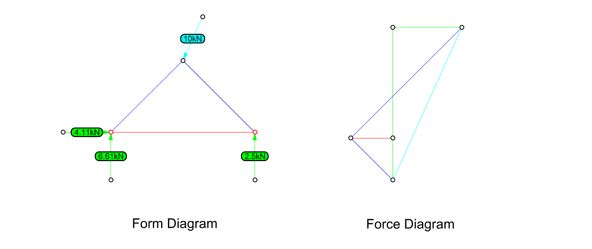

# 1.1. Single Panel

Let's start with the following simple example of a single panel truss. The geometry, loads and support conditions are depicted in the figure below:

.png>)

The hypothesis of our analysis will be:

* The force applied on the top has magnitude of **10 kN**.
* The left support is a pin (restraint on x, y) and the right support a roller (restraint on y)

The set of lines for this exercise is available in the previous [page](./). As mentioned before, the load (blue) and reaction directions (green) are repressented as lines:

.png>)

### 1. Making the Form Diagram

In the toolbar of IGS go to the function  `Create Form Diagram` and select the option `FromLines` . The FormDiagram will be created and you can notice a difference in the colour of **internal edges** (structure) and **external edges** (loads and reactions).

.png>)

The Form Diagram edges will be stored in a new layer created, at `IGS >> FormDiagram`. The future Force Diagram will also be drawn in the dedicated created layer `IGS >> ForceDiagram`.

.png>)


The input lines will be hidden from the canvas, to avoid overlap with the newly created Form Diagram. If you need to view them again you need to type the command `Show` in Rhino, or click with the right button in the icon over the main toolbar, as shown below. The input edges should remain hidden during this tutorial.


.png>)

### 2.2. Setting loaded edges&#x20;

The truss is an isostatic example in which there's only one load applied. We can chose the magnitude of this force freely. We could also apply the equation explained in the first part, here we have `m=7` edges and `ni=3` internal nodes (`DOF = m - 2*ni = 1`).&#x20;

Click over the Assign Forces button. Select the edge representing the load and apply a magnitude of **-10 kN** since the force should push the panel. The edges will display numered and in this case you should apply the force to the edge #0.

.png>)

After we hit OK, the forces applied are shown in the edges with an arrow. Verify that the arrow direction corresponds to the desired direction of the applied loads.

.png>)

### 2.3. Setting supports&#x20;

Supports should be assigned to the nodes where reaction forces are applied. Go to the function `Identify Anchors` and select the two nodes in the base of the single panel. These nodes will be highlighted in red as in the figure below:

.png>)

### 2.4. Compute the Force Diagram&#x20;

After setting the loads we can compute the equilibrium by calculating the force diagram in the button `Create Force Diagram`, the force diagram is automatically generated right to the form diagram. The result should be as below:

Note that the reaction forces now display also the value and direction. The default visualisation for form and force is the red-blue colouring. **Blue** represents **compression** and **red** **tension**. At this point, the scale and location of the force diagram is automatically set by IGS.&#x20;

### 2.5. Display Settings

A series of display options can be modified to help to visualise the diagrams. These options are organised in the two tabs of the `Display Settings` menu: FormObject and Force Object, as depicted below:

.png>)

Therefore, the red/blue colouring can be turned on and off (_forcecolors_). Equally the edge and vertex labels can be turned on and off. Additionally, force labels, indicating the magnitude the force on the edges are available for both diagrams. For the Form Diagram, pipes can be drawn in the edges with thickness proportional to the load carried. The scale of these pipes can also be modified in the display settings panel.&#x20;

The scale and the location of the Force diagram can be modified in the appropriate functions over the **IGS** Menu Display > `ForceDiagram Location` and `ForceDiagram Scale` .

### 2.6. Inspect Diagrams.

To analyse the magnitude of the forces in specific edges three options are available in the Button `Inspect Diagrams`. An **EdgesTable** can be displayed with information about all the forces in the structure, additionally, information about one specific edge of the structure can be queried with the option **EdgeInformation**, and the duality can be inspected with the function **ForcePolygons.**

.png>)

.png>)

.png>)
