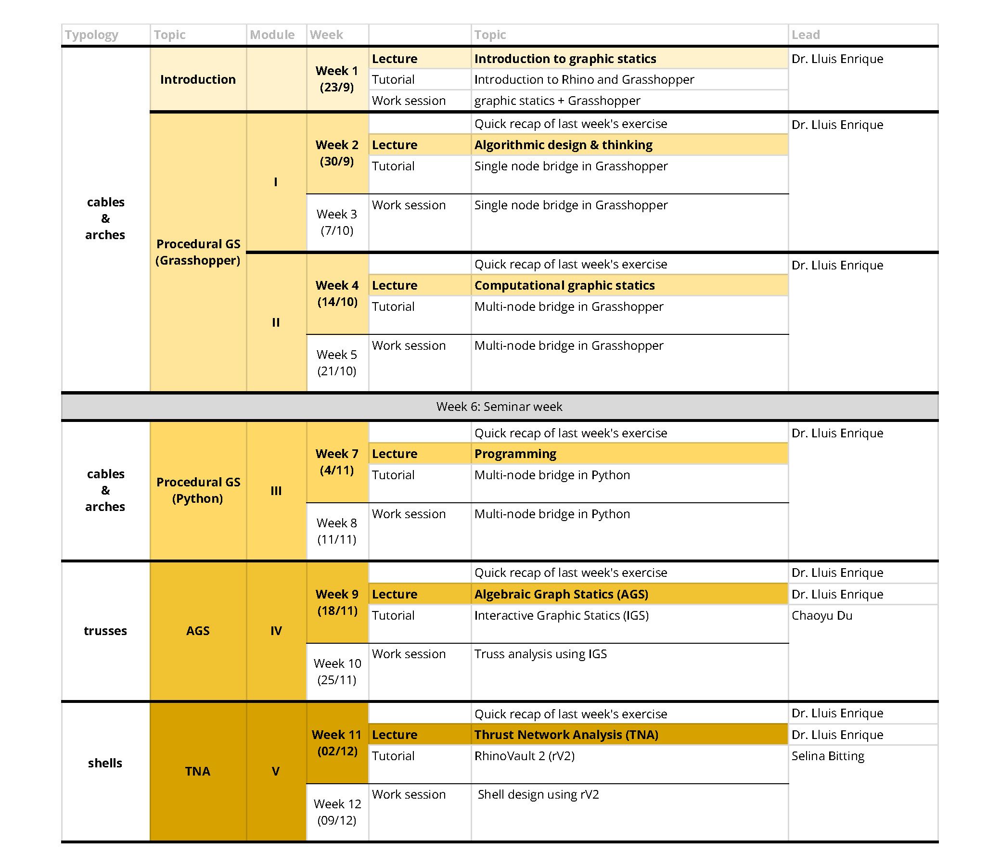

# Syllabus

## 1. Learning goals

At the conclusion of this course, participants will have:&#x20;

* Fundamental knowledge of graphic statics.
* Basic parametric thinking and modelling with Rhinoceros and Grasshopper.&#x20;
* Elementary skills in Python scripting.
* Experience using computational tools based on graphic statics for the design and analysis of structures.&#x20;
* Understanding of the potential of studying graphic statics using computational tools.

## 2. Course overview

### Modules

The course is divided into 5 modules:

* **Module 1** - Procedural construction of 2D interactive graphic statics drawings of single node funicular structures
* **Module 2** - Procedural construction of 2D interactive graphic statics drawings of multi-node funicular structures
* **Module 3** - Programming of 2D interactive graphic statics drawings of multi-node funicular structures using GhPython&#x20;
* **Module 4** - Automatic construction of 2D interactive graphic statics drawings for trusses with Interactive Graphic Statics (IGS)
* **Module 5** - Form-finding explorations of 2.5D, funicular shell structures with RhinoVAULT 2 (RV2)

## 3. Class structure

Each module consists of three parts: a lecture, a tutorial, and a work session.

### Lecture

Lectures will be 30-45 minute presentations given by one of the lecturers. It will introduce the main topic of the module, as well as the key concepts, theoretical background, and relevant examples and case studies. The lectures will be given in [HPT](http://www.mapsearch.ethz.ch/map/mapSearchPre.do?gebaeudeMap=HPT\&geschossMap=C\&raumMap=103\&farbcode=c010\&lang=en) [C 103](http://www.rauminfo.ethz.ch/Rauminfo/grundrissplan.gif?gebaeude=HPT\&geschoss=C\&raumNr=103\&lang=en) and livestreamed. The lecture will be recorded and posted online after the lecture. For those attending the lectures remotely, questions can be posted in the Slack channel **#lectures**.

### Tutorial

Tutorials are interactive, "follow-along" sessions that are intended to teach specific computational methods and tools, and the relevant technical knowledge. Each tutorial session (45 mins or 2x 45mins) will be led by one of the instructors, and the students are expected to follow along step by step and ask any questions as needed. The tutorials will take place in [HPT](http://www.mapsearch.ethz.ch/map/mapSearchPre.do?gebaeudeMap=HPT\&geschossMap=C\&raumMap=103\&farbcode=c010\&lang=en) [C 103](http://www.rauminfo.ethz.ch/Rauminfo/grundrissplan.gif?gebaeude=HPT\&geschoss=C\&raumNr=103\&lang=en) and livestreamed. The tutorials will be recorded and posted online after the tutorial.&#x20;

### Work session

The exercise (homework) for each module will be introduced and assigned at the beginning of each work session. Work sessions provide an opportunity for the students to start working on the exercises during class hours. All PhD instructors will be present during the work sessions to provide technical support or consultations. Students are expected to be present during the work sessions and are strongly encouraged to work on the exercise and engage with the instructors and other students. The work sessions will take place in  [HPT](http://www.mapsearch.ethz.ch/map/mapSearchPre.do?gebaeudeMap=HPT\&geschossMap=C\&raumMap=103\&farbcode=c010\&lang=en) [C 103](http://www.rauminfo.ethz.ch/Rauminfo/grundrissplan.gif?gebaeude=HPT\&geschoss=C\&raumNr=103\&lang=en).&#x20;

## 4. Schedule

<figure><figcaption></figcaption></figure>

## 5. Evaluation

The students will be evaluated based on the completion of 6 exercises (introduction task + one exercise per module). There is no final exam. Each exercise will be assigned at the beginning of each work session and will be due at the beginning of the next lecture. The final grade for the course will be the average grade of the 6 exercises.


**Late submission will NOT be accepted.**

In case of medical or family emergencies that force a delay in your submission, you must show a medical report.


Each exercise will be evaluated based on two criteria:

**1. Completeness of the computational task** - **** For each task of the exercise, completed and working Rhino files and also supporting Grasshopper files must be submitted. &#x20;

**2. Communicating the process and results with clarity** - In computational research, communicating one's abstract ideas, technical procedures/approach and results are just as important as the research itself. For each exercise, the files mentioned above should be accompanied by a document (using the template provided, for each exercise), which answers the questions of the exercises and include any additional comments or remarks. The questions need to be answered with clear writing and supported by images, screenshots, hand sketches, or any other additional material.&#x20;

### Submissions

For each exercise, the students will be asked to submit a zipped folder that contains:

1. Complete and working Rhino, Grashopper, script, or other files
2. a PDF summarizing and presenting the results of the exercise, through text and images


#### File naming convention

exercise-number\_item-number\_firstname-lastname.extension

* exercise-1\_jane\_smith.zip
  * exercise-1\_task-1\_jane-smith.3dm
  * exercise-1\_task-1\_jane-smith.gh
  * exercise-1\_jane-smith.pdf
  * exercise-1\_task-2\_jane-smith.3dm
  * exercise-1\_task-2\_jane-smith.ags
  * ...
  *


## 6. Communication

### Slack

Due to the hands-on, technical nature of the course's tutorial and exercises, [Slack](https://slack.com/intl/en-ch/) will be used to provide real-time technical support, communication, and feedback. You can join the dedicated Slack workspace for the course [**here**](https://join.slack.com/t/csd12022/shared\_invite/zt-1fkf0zpba-06Fwf2L2JuHA0IcsCwRNDg).

### Email

For administrative-related questions, you can also e-mail us. You can find our email addresses [**here**](instructors.md).
